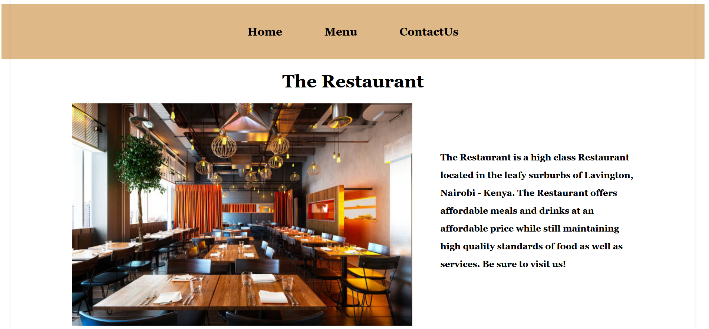
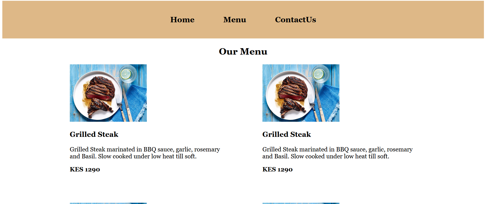

# Restaurant

## Definition

Is a simple restaurant Website

## About the Project

This project is a simple restaurant page. It uses JavaScript to render all the DOM elements with the html file containing only the basic skeleton tags, i.e. html, title, body and a single div.


-


The DOM Elements are build mainly from JS:


## Built With

- HTML5
- CSS3
- JavaScript
- NPM
- WebPack
- ES6

## Live Demo

[Live Demo Link]( https://karvel-code.github.io/restaurant-page/)


## Getting Started

**Just clone this repo and open index.html file in your browser then you are good to go.**


**To get a local copy up and running follow these simple example steps.**

### clone the repo.
- in your terminal,  run
``` git clone https://github.com/karvel-code/restaurant-page.git ```
- open the directory
``` cd resturant```
- Open the ``` dist/index.html``` file in the browser.


## Author

👤 **Elvis Githinji**

- GitHub: [@karvel-code](https://github.com/karvel-code)
- LinkedIn: [Elvis Githinji](https://www.linkedin.com/in/elvisgithinji/)

## 🤝 Contributing

Contributions, issues, and feature requests are welcome!

## Show your support

Give a ⭐️ if you like this project!

## Acknowledgments

-  [The Odin Project](https://www.theodinproject.com/)
